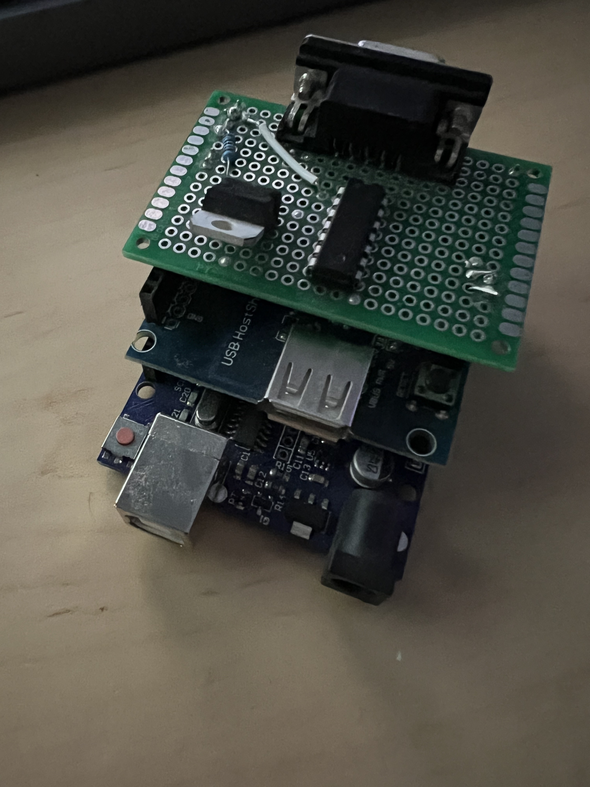
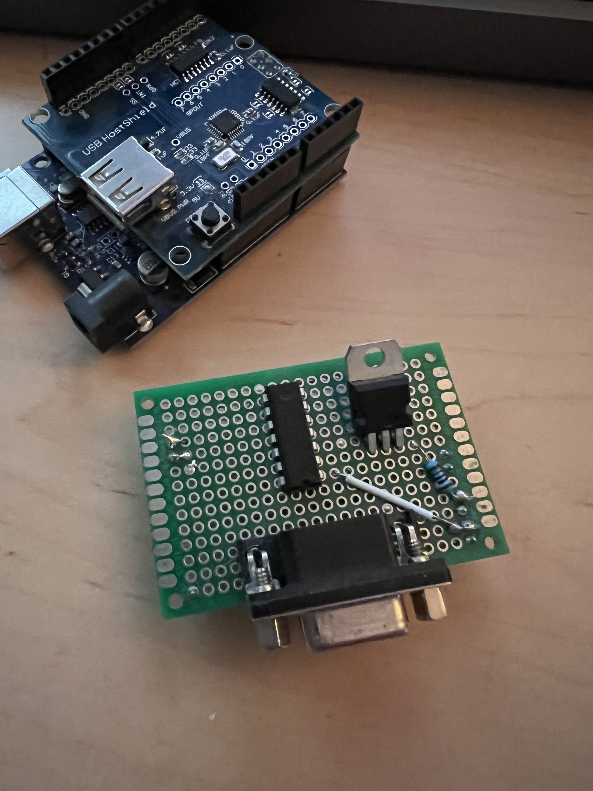
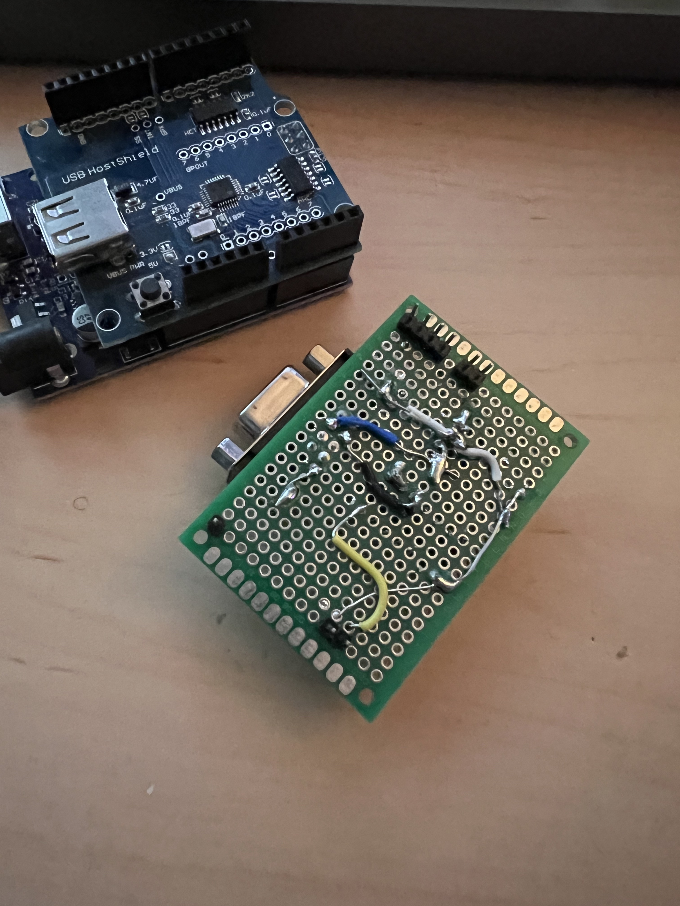

# Arduino Leonardo/Uno based USB to Serial mouse converter 

A repo outlining the code and design for an Leonardo/Uno based USB to Serial mouse converter.  

Requires a basic USB Host Shield, a Leonardo or Uno Arduino, and the hacky voltage leveling circuit (there are FAR better ways to do this, I just had parts on hand).

Source for that is from [my repo which is forked](https://github.com/kroy-the-rabbit/ps2serial). I just took the idea from there and turned it into a custom "hat".

The serial side of the code is from that repo as well, with the USB side being from the standard Arduino USB examples.

Pictures of the build and "hat".  You could/should do this with a MAX232, but I didn't have any on hand:

